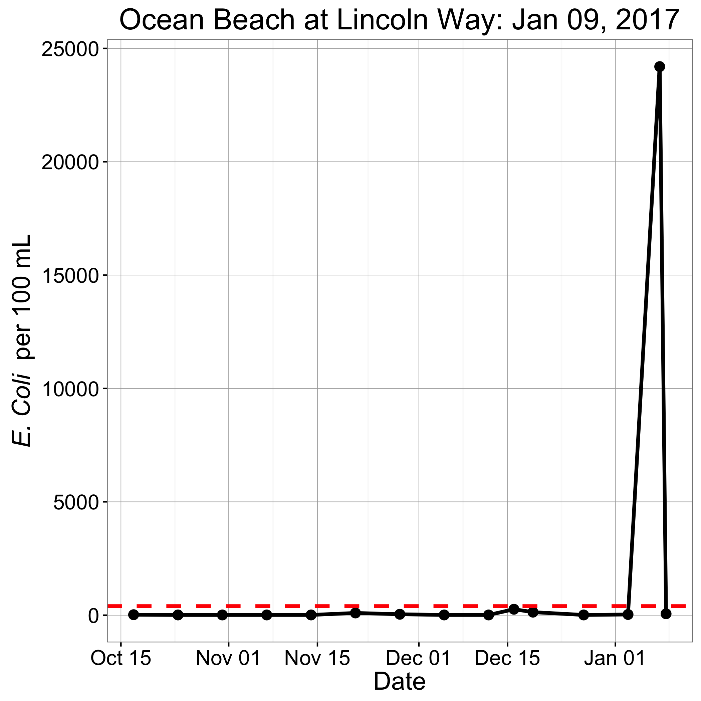

## Beach Poo Bot  :poop:

<p align="center">
  
</p>
---

### Bio :umbrella:
I check ocean and surf conditions regularly. The motivation for this project started when I found no automated e-system to receive updates on water quality for San Francisco's beaches. 

Fortunately, the <a href="http://sfwater.org/index.aspx?page=67" tarte="_blank">San Francisco Public Utilities Commission</a>  has a great website that includes <a href="http://sfwater.org/cfapps/lims/beachmain1.cfm" target="_blank">a regularly
updated map.</a> They are also hip to the value of open source. Regularly updated coliform bacteria count data are made available to the public. Which, as a first approximation in terms of internet users, is about one half of the 7.3 billion (or
about 3.4e09) humans on this planet.

Nevertheless... If you're lazy like me and already have too many tabs open in you browser, you develop a helper bot to automatically relay updated conditions: <a href="https://twitter.com/BeachPooBot" target="_blank">@BeachPooBot</a> was born into
the wild on 2016-03-19 14:05:37 (local time), in Pacifica, CA. It has been downloading and processing publically available data daily since then -- tweeting updated fecal counts and sewer overflow alerts for San Francisco. 

At this stage in Poo Bot's life cycle, the Twitter account's following has expanded to more than 100 accounts. These followers include a diverse set of beach recreationalists, a relavent local government agency <a href="https://twitter.com/SFWater"
target="_blank">@SFWater</a>, non governmental conservation groups like <a href="https://twitter.com/SFBaykeeper" target="_blank">@SFBaykeeper</a>, others interested generally in water quality, and even at one point, 'Ангелина' the sexy spam bot (had
to report that one, and lose a follower. Sorry not sorry, 'Angelina').     

Technical background is outlined below. If you'd like to see an improvement in the project, reach out to @BeachPooBot via Twitter, or better yet submit a pull request through GitHub to collaborate on the code or other files! 

<a href="http://www.cdph.ca.gov/HealthInfo/environhealth/water/Pages/Beaches.aspx" target="_blank">Regulations for public beaches and ocean water-contact sports areas are available from the California Department of Public Health.</a>  

For the latest status of SFOB shoreline sampling locations, please refer to the <a href="http://www.sfwater.org/cfapps/lims/beachmain1.cfm" target="_blank">SF Beach Water Quality map.</a> 

### Technical details :ocean: 

This TwitterBot downloads and processes San Francisco Bay and Ocean Beach water quality data from the SF Water Power Sewer web server. It does this twice a day --- at 1015 and 1415 hrs (Pacific Time) --- 15 min after
data are updated on the server. 

For a recent raw data set, dating back to 2015-12-21, see the time series of `*.csv` files in BeachPooBot's data directory. This data contains all available sampling locations including several beaches that are currently included in the Poo Bot's
'tweet on update' list. The list of locations that Poo Bot checks is determined in part by follower feedback and requests on Twitter. The original list contained several surfing locations along Ocean Beach, and has been expanded to include areas inside the bay that are
popular with kite-boarders and that bunch of crazy-impressive SF Bay swimmers.

After downloading the full data set, the bot compares the latest sample time-date with that from the previous download, and thus determines if a new sample has been posted. 

If a new sample has been posted, the bot wrangles the data: filtering by location; compiling *E.coli* counts; scraping SF Bay Water websites to extract the posting status of beaches from HTML (*e.g.* "Sewer Overflow"); composes tweets
with updated coliform bacteria counts + beach status descriptions and their corresponding emoji symbols --> Sewer Overflow :bangbang: :skull: :bangbang:

The bot then logs-in through the Twitter API to tweet updated *E.coli* counts per 100ml for Ocean Beach at Lincoln Way. A second tweet is also sent if there have been any updates to the posting status of the filtered set of sampling locations along Ocean Beach and into the mouth
of SF Bay. The bot does not tweet if no new samples have been posted; it runs quietly in the background until it detects a status update.
 
The main code for the bot is written in `R`. In brief, the main files (and duties) are: `./R/ScrapePoo.R` (data processing); `./R/GetBeachStatus.R` (web-scraping)  and `./R/TweetShit.R` (to interface with Twitter's API). Additional technical details are provided in the comments and function descriptions in the code files themselves.  

The bot's program can be scripted in Bash by executing `./R/rShellScript.sh`. To replicate this, you would need to edit this script to include your paths.   

Currently, the bot is automated according to parameters stored in a `*.plist` file running on JB's laptop (Mac OS 10.11.6). The `*.plist` file is written in `XML`. It is stored under the global Launch Agent directory, i.e. `/Library/LaunchAgents/com.rTask.plist`.  Example `XML`
for that file is shown below:

```XML
<?xml version="1.0" encoding="UTF-8"?>
<!DOCTYPE plist PUBLIC "-//Apple//DTD PLIST 1.0//EN" "http://www.apple.com/DTDs/PropertyList-1.0.dtd">
<plist version="1.0">
<dict>
	<key>Label</key>
	<string>com.rTask</string>
	<key>Program</key>
	<string>/Users/johnbrandon/documents/R_hobby/BeachWater/R/rShellScript.sh</string>
	<key>RunAtLoad</key>
	<true/>
	<key>StandardErrorPath</key>
	<string>/tmp/com.rTask.err</string>
	<key>StandardOutPath</key>
	<string>/tmp/com.rTask.out</string>
	<key>StartCalendarInterval</key>
	<array>
		<dict>
			<key>Hour</key>
			<integer>10</integer>
			<key>Minute</key>
			<integer>15</integer>
		</dict>
		<dict>
			<key>Hour</key>
			<integer>14</integer>
			<key>Minute</key>
			<integer>15</integer>
		</dict>
	</array>
</dict>
</plist>
```


